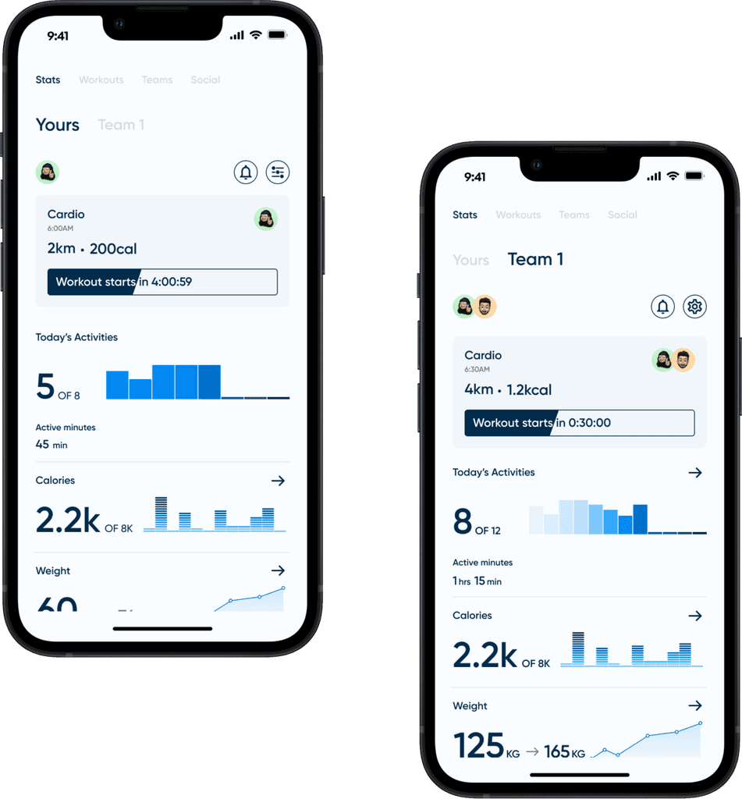
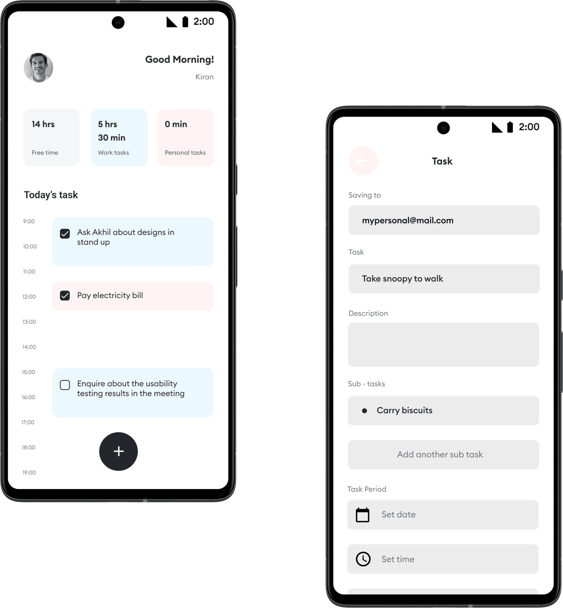
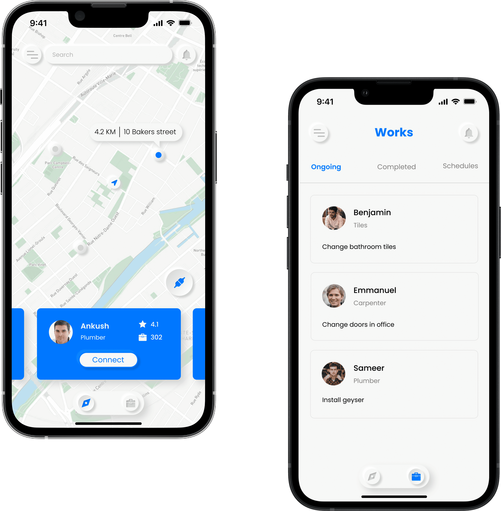
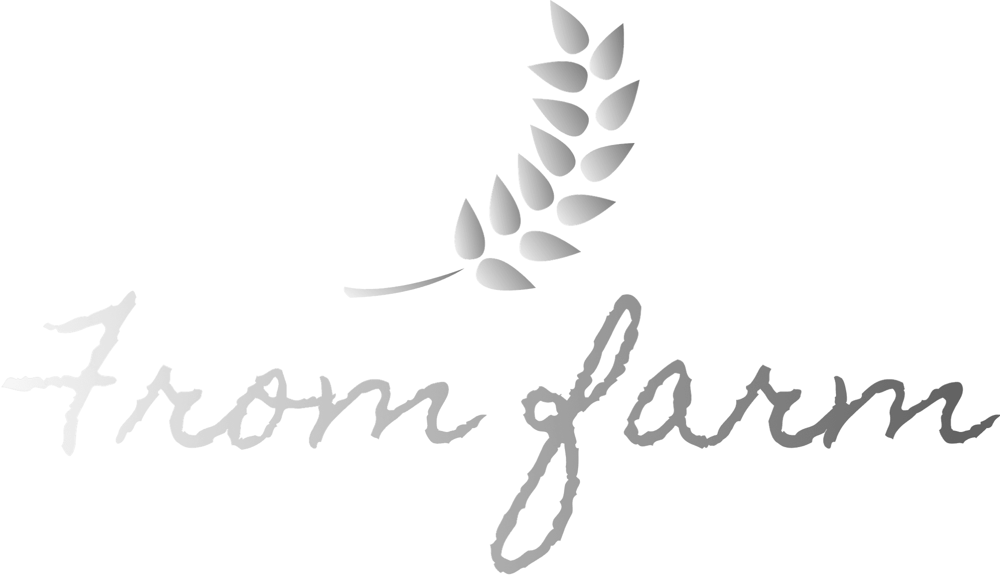

# App Projects

## Fit X

A fitness app focused on user motivation, tracking, and engagement for healthier lifestyles.

---

## Aftercrop

Aftercrop, a mobile-first software solution designed to simplify warehouse operations. With a keen focus on design, adaptability, and user-friendliness.

---

## Swiggy

A case study addressing the challenge of time constraints in food delivery by designing a scheduling feature and subscription model.

---

## Inflight

In this case study, I tackle the challenge of in-flight dining by designing a user-friendly mobile app for on-demand food orders.

---

## To Do

In this case study, I embark on a journey to reimagine and redesign an existing app, enhancing its usability and aesthetics.

---

## We Wrk

Addressing the modern challenge of finding reliable artisans and facilitating home repairs through an innovative mobile application.

---

## From Farm

In this case study, explore how I designed 'From Farm,' an app revolutionizing the way we buy fresh produce directly from farmers.

---

## Monastery

A minimalist finance management app for effortless expense tracking and management.

