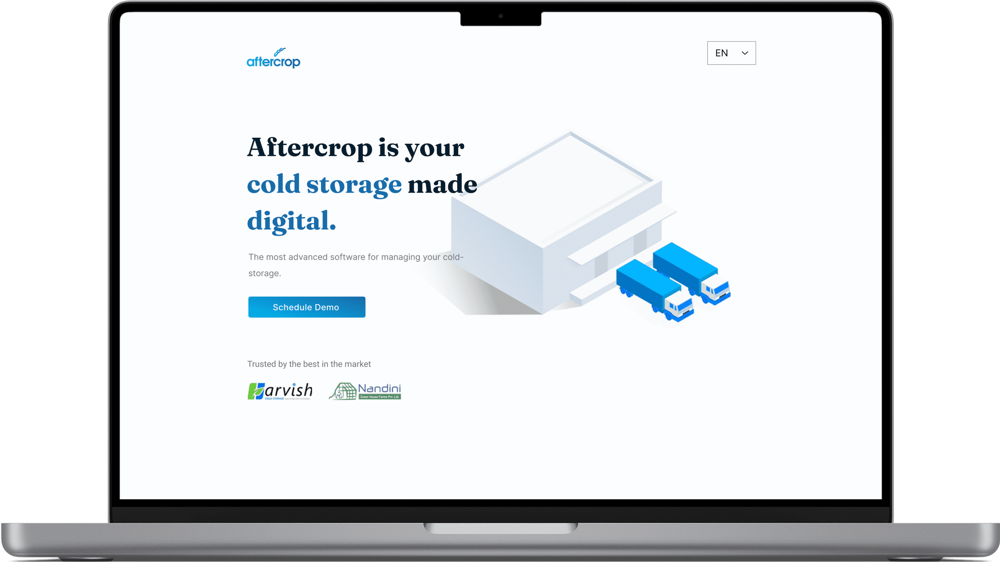
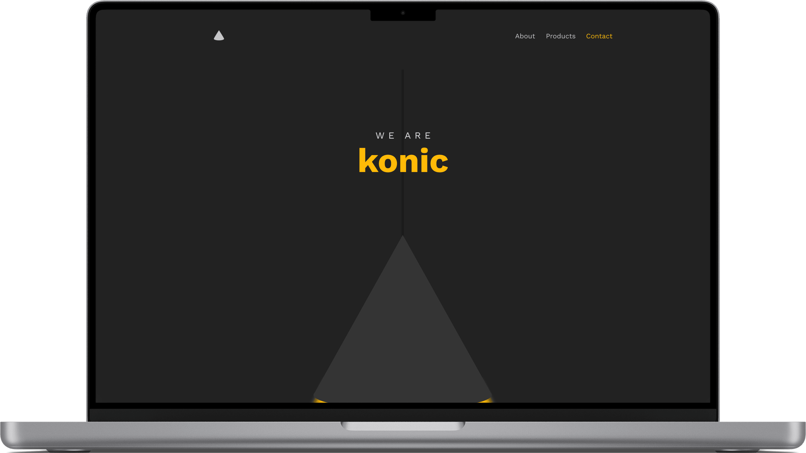

# Website Projects

## Learn Hadiya

'Learn Hadiya,' a user-friendly web app for foreigners to easily learn the Hadiya language in Ethiopia.

[Go to Website](#)

---

## Aftercrop (Microsite)

Microsite for SaaS-based cold storage and warehouse operations management application.

[Go to Website](#)

---

## Konic

Microsite of Konic Technologies develops products in enterprise applications that revolutionize the sector.

[Go to Website](#)
